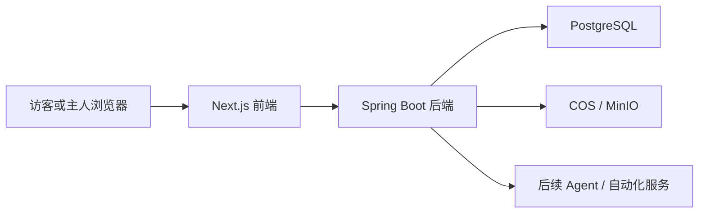

# 系统总览

## 目标

说明 Inkdesk 当前 MVP 的系统边界、职责拆分、关键数据流与部署形态。

## 系统定位

Inkdesk 的长期目标是一个围绕长期项目运转的个人主系统。当前 MVP 采用公开入口 + 主系统入口的实现方式：

- 公开输出 / 分享层：公开文章与项目分享
- 主系统：主人登录后进入的私有系统

在 MVP 阶段，系统重点解决以下问题：

- 访客只能看到公开输出入口
- 主人通过隐藏入口进入主系统
- 主系统以 Agent 控制台为第一屏
- 笔记、任务计划、检索与次级发布模块围绕主系统协同

## 核心技术栈

- 前端：`Next.js`
- 后端：`Spring Boot`
- 数据库：`PostgreSQL`
- 对象存储：生产环境使用 `腾讯云 COS`，本地开发使用 `MinIO`
- 内容事实来源：`Markdown`

## 系统边界

### 系统内部

- 公开输出前端
- 主系统前端
- 内容与认证后端
- PostgreSQL
- 对象存储

### 系统外部

- 浏览器访客
- 主人
- 腾讯云基础设施
- GitHub 仓库与 CI/CD
- 后续 Agent / 自动化服务

## 职责划分

### 前端职责

- 渲染公开输出首页与公开文章页
- 渲染主系统页面与主导航
- 承担隐藏登录入口与入口切换逻辑
- 组织 Agent 控制台、笔记、任务计划、检索与发布模块

### 后端职责

- 处理认证与主人身份
- 提供笔记、计划、检索、发布等接口
- 提供公开文章读取能力
- 为未来对象存储接入保留基础设施形态

### 数据库职责

- 存储主人信息
- 存储笔记与修订
- 存储任务 / 计划
- 存储发布信息与 slug

### 对象存储职责

- 本地阶段使用 `MinIO` 预留对象存储形态
- 当前本轮不接入知识资产附件上传

## 请求与数据流

### 主请求流

1. 访客访问 `/`，或主人访问 `/login` / `/app`
2. 前端根据身份与路由渲染公开输出入口或主系统
3. 前端向后端发起认证、内容、计划、检索、发布请求
4. 后端读写数据库与对象存储
5. 结果返回前端渲染

## 部署形态

Inkdesk 当前仍保持单体 MVP 形态：

- 单一 Git 仓库
- 单一前端应用
- 单一后端应用
- 一个 PostgreSQL 实例
- 一个对象存储桶
- 一个 Nginx 入口

## 输出层与主系统关系

- 公开输出层只展示主人主动公开的内容
- 主系统负责组织、编辑、检索、计划与同步
- 公开输出层不承担系统入口职责
- 主系统不承担访客导览职责

## 非目标

- 多人协作
- 实时协同编辑
- 复杂权限体系
- 完整自动化引擎
- 真正 автономous Agent 执行闭环
