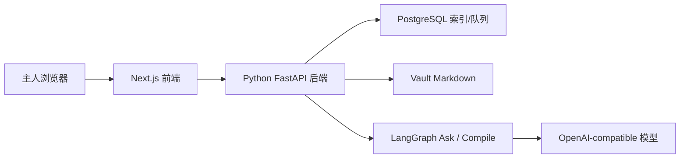

# 系统总览

## 目标

说明 Inkdesk 当前主产品的系统边界、职责拆分、关键数据流与部署形态。

## 系统定位

Inkdesk 当前不是公开发布系统，而是一个单人私有、vault-first 的 Agent Knowledge Runtime。

用户可感知的主路径是：

```text
Ask -> 沉淀
```

用户在每个回答后决定是否沉淀；沉淀后的 topic 路由、claim 提取、证据绑定、冲突检测、wiki patch 和质量门控由后台 Agent 完成。

系统内部仍围绕下面这条可审计研究闭环展开：

```text
raw -> ingest -> wiki -> ask
```

- `raw/`：保存网页、PDF、legacy note 等原始材料
- `ingest`：Agent 生成可审阅提案，等待人工接受或拒绝
- `wiki/`：保存被接受后的知识页与长期记忆
- `ask`：优先基于 wiki、再回退 raw 的研究问答和回答沉淀入口

## 核心技术栈

- 前端：`Next.js`
- 后端：`FastAPI / Python`
- Agent runtime：`LangGraph`
- 数据库：`PostgreSQL`
- 本地对象存储占位：`MinIO`
- 内容事实来源：`Vault Markdown`

## 系统边界

### 系统内部

- 私有前端工作区
- Python 主后端
- LangGraph Ask / Compile runtime
- PostgreSQL
- 本地 vault 文件系统

### 系统外部

- 主人浏览器
- Claude Code / Codex / Cursor 等外部 Agent（未来通过 MCP / CLI 接入）
- 外部网页 / PDF 来源
- OpenAI-compatible 模型服务
- GitHub 仓库与 CI/CD

## 职责划分

### 前端职责

- 渲染登录页、问答主入口、raw / ingest / wiki 页面
- 组织 owner session 与私有路由守卫
- 展示提案审阅、wiki 页面、问答结果和沉淀入口

### 后端职责

- 处理认证与 owner 会话
- 维护 raw / ingest / wiki / ask API
- 读写 vault markdown
- 编排 LangGraph Ask / Compile runtime
- 维护数据库索引、提案队列和问答记录
- 后续提供 deposit orchestration 与 MCP / CLI 接入

### 数据库职责

- 存储 owner、workspace、source、topic、review、ask turn 等索引数据
- 追踪提案状态与 wiki/source 关系
- 作为缓存和工作流状态层，而不是最终知识真相

### Vault 职责

- 持久化 `raw/` 与 `wiki/` markdown 文件
- 保存 frontmatter、引用来源与知识页结构
- 作为长期真相来源，允许 DB 缺失后重建索引

## 请求与数据流



### 主请求流

1. 主人访问 `/login` 或 `/app`
2. 前端根据 session 渲染私有工作区
3. 前端向后端发起 raw、ingest、wiki、ask 请求
4. 后端读写 PostgreSQL 与 vault markdown
5. Ask / Compile 在需要时调用 LangGraph runtime
6. 结果返回前端渲染，每个回答提供沉淀入口
7. 用户触发沉淀后，后台 Agent 生成可审阅或可写入的知识变更
8. 知识只在通过审阅或质量门控后进入 wiki

### 外部 Agent 请求流（规划）

1. Claude Code、Codex 或 Cursor 调用 Inkdesk MCP / CLI
2. `context_pack` 返回当前任务相关的短上下文包
3. 外部 Agent 完成任务并询问用户是否沉淀
4. 用户确认后调用 `deposit`
5. Inkdesk 复用同一套后台沉淀流水线

## 部署形态

Inkdesk 当前保持单体私有部署形态：

- 单一 Git 仓库
- 单一 Next.js 前端应用
- 单一 Python 主后端
- 一个 PostgreSQL 实例
- 一个本地或挂载 vault 目录
- 一个 Nginx 入口

## 当前边界

- 不提供公开阅读面
- 不提供 plans / publish / settings 主路径
- 不做多租户或多人协作
- 不允许 AI 静默改写 wiki
- 不做长时自治执行 loop
- 外部 Agent 只通过取上下文和沉淀接口接入，不直接写 vault
