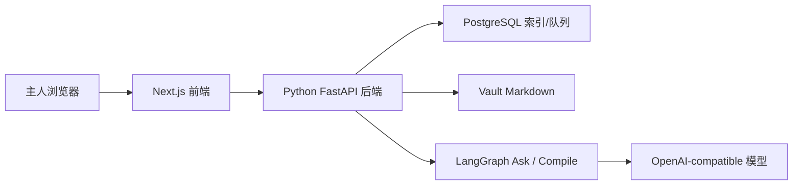

# 系统总览

## 目标

说明 Inkdesk 当前主产品的系统边界、职责拆分、关键数据流与部署形态。

## 系统定位

Inkdesk 当前不是公开发布系统，而是一个单人私有、vault-first 的 AI R&D Automation Runtime。

用户可感知的主路径是：

```text
PRD / 研发任务 -> Dev Run -> Review / Deposit
```

用户从 PRD、bug 或改造目标进入研发任务运行台；Context Ask、topic 路由、claim 提取、证据绑定、冲突检测、wiki patch、Skill 输出和质量门控由后台 Agent 与后端服务协作完成。

系统内部仍围绕下面这条可审计研究闭环展开：

```text
raw -> ingest -> wiki -> ask
```

- `raw/`：保存网页、PDF、legacy note 等原始材料
- `ingest`：Agent 生成可审阅提案，等待人工接受或拒绝
- `wiki/`：保存被接受后的知识页与长期记忆
- `ask`：优先基于 wiki、再回退 raw 的 Context Ask 和回答沉淀入口

## 核心技术栈

- 前端：`Next.js`
- 后端：`FastAPI / Python`
- Agent runtime：`LangGraph`
- 数据库：`PostgreSQL`
- 本地对象存储占位：`MinIO`
- 内容事实来源：`Vault Markdown`

## 系统边界

### 控制面与执行面

Inkdesk 不试图替代外部 Agent（Claude Code、Codex 等），而是明确划分边界：

```text
Inkdesk 控制面（LangGraph 编排）
  ├─ Context Pack 准备
  ├─ 技术方案生成（读 wiki + raw）
  ├─ 技术方案评审
  ├─ gate 检查（"方案未评审 → 阻塞 coding"）
  ├─ coding briefing 组装
  ├─ test-fix 过程追踪
  ├─ deposit 与知识沉淀
  └─ 评测（Golden Tasks + LLM Judge）

外部 Agent 执行面（Claude Code / Codex）
  ├─ 读代码仓库、写文件
  ├─ 执行 coding
  ├─ 跑测试、看报错
  └─ debugging / 修复
```

LangGraph 编排的是知识层的有状态流程，不是代码生成：

- raw → insight → evidence → topic routing → conflict check → patch（各步骤可能需要 owner 裁决）
- Context Ask：wiki first → raw second → 缺口判断 → writeback
- Wiki Health 扫描（规则驱动，跑在 vault 文件和 DB 索引上）
- Skill 链的 gate 状态机（"评审通过了吗？" → 阻塞/放行）

造一个和 Claude Code 同等水平的 coding agent 需要专门团队和持续投入。Inkdesk 作为单人项目，正确的选择是把 coding 执行委托给外部 Agent，自己专注在它们做不到的事：让这次 coding 的判断不散掉，让下次任务知道上次发生了什么。

Harness 负责桥接两端：当 gate 放行 coding 阶段，组装 briefing 调用外部 Agent；Agent 执行完成后 run_event 回写结果，Harness 推进到下一阶段。

### 系统内部

- 私有前端工作区
- Dev Run Console（目标）
- Python 主后端
- LangGraph Ask / Compile runtime
- PostgreSQL
- 本地 vault 文件系统

### 系统外部

- 主人浏览器
- Claude Code / Codex / Cursor 等外部 Agent（未来通过 MCP / CLI 接入）
- 外部网页 / PDF 来源
- OpenAI-compatible 模型服务
- GitHub 仓库与 CI/CD

## 职责划分

### 前端职责

- 渲染登录页、Dev Run Console、Context Ask、raw / ingest / wiki 页面
- 组织 owner session 与私有路由守卫
- 展示提案审阅、wiki 页面、问答结果和沉淀入口

### 后端职责

- 处理认证与 owner 会话
- 维护 raw / ingest / wiki / ask API
- 后续维护 Dev Run / Skill Run / Evaluation API
- 读写 vault markdown
- 编排 LangGraph Ask / Compile runtime
- 维护数据库索引、提案队列和问答记录
- 后续提供 deposit orchestration 与 MCP / CLI 接入

### 数据库职责

- 存储 owner、workspace、source、topic、review、ask turn 等索引数据
- 追踪提案状态与 wiki/source 关系
- 作为缓存和工作流状态层，而不是最终知识真相

### Vault 职责

- 持久化 `raw/` 与 `wiki/` markdown 文件
- 保存 frontmatter、引用来源与知识页结构
- 作为长期真相来源，允许 DB 缺失后重建索引

## 请求与数据流



### 主请求流

1. 主人访问 `/login` 或 `/app`
2. 前端根据 session 渲染私有工作区
3. 前端向后端发起 raw、ingest、wiki、ask 请求
4. 后端读写 PostgreSQL 与 vault markdown
5. Ask / Compile 在需要时调用 LangGraph runtime
6. 结果返回前端渲染，每个回答提供沉淀入口
7. 用户触发沉淀后，后台 Agent 生成可审阅或可写入的知识变更
8. 知识只在通过审阅或质量门控后进入 wiki

### Dev Run 请求流（目标）

1. 主人在 `/app` 创建 PRD / bug / 改造任务
2. 前端展示 Dev Run 阶段轨道和当前待确认输出
3. 后端生成 context pack，调用 Skills 或外部 Agent
4. 每个阶段输出进入 review / gate
5. 通过 gate 的输出进入下一阶段，关键判断进入 deposit
6. 最终 run 记录、方案、修复经验和 wiki 变更可追溯

### 外部 Agent 请求流

**自动路径（Harness 驱动）：**

1. Inkdesk Harness 在 coding / test 阶段调用外部 Agent MCP
2. 传入 context_pack 和阶段 briefing
3. 外部 Agent 执行 coding、测试或修复任务
4. Agent 通过 `run_event` 自动回写阶段产物、测试结果和阻塞点
5. Harness 根据回写结果推进 gate 或触发下一阶段

**手动路径（用户驱动）：**

1. 用户在外部 Agent 中做探索性工作，手动调用 MCP
2. `context_pack` 返回当前研发任务相关的短上下文包
3. 用户完成任务后手动调用 `deposit`
4. Inkdesk 复用同一套后台沉淀流水线

两条路径共用同一套 MCP 工具，详见 [工具链与模型上下文协议](工具链与模型上下文协议.md)。

## 部署形态

Inkdesk 当前保持单体私有部署形态：

- 单一 Git 仓库
- 单一 Next.js 前端应用
- 单一 Python 主后端
- 一个 PostgreSQL 实例
- 一个本地或挂载 vault 目录
- 一个 Nginx 入口

## 当前边界

- 不提供公开阅读面
- 不提供 plans / publish / settings 主路径
- 不做多租户或多人协作
- 不允许 AI 静默改写 wiki
- 不做长时自治执行 loop
- 外部 Agent 只通过取上下文和沉淀接口接入，不直接写 vault
