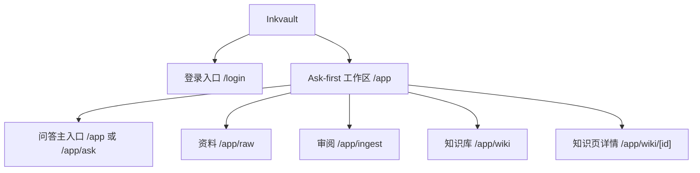
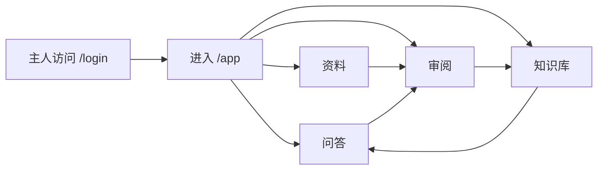

# 信息架构

## 目标

这份文档固定 Inkvault 当前 MVP 的私有研究工作台结构，确保产品、设计和前端对页面边界保持一致。

## 顶层结构

Inkvault 的当前主产品是一个单人私有 Ask-first 研究工作区，围绕 `raw -> ingest -> wiki -> ask` 运转：

## 路由规则

### 根路由行为

- 未登录访问 `/`：跳转到 `/login`
- 已登录访问 `/`：自动进入 `/app`

### 登录路由

- `/login`
  - 目标：主人隐藏登录入口
  - 职责：进入私有研究工作区

### 主系统路由

- `/app`
  - 目标：作为主人进入后的第一屏
  - 职责：直接进入 Ask-first 研究入口，展示 briefing hero、建议问题、提问区与判断面板
- `/app/ask`
  - 目标：兼容旧问答直达入口
  - 职责：复用 `/app` 同一 Ask-first 页面，实现提问、追问、知识缺口、引用来源、联网补料与回写动作
- `/app/raw`
  - 目标：导入和管理原始材料
  - 职责：承接网页、PDF、文本等研究输入
- `/app/ingest`
  - 目标：审阅 AI 编译提案
  - 职责：作为 raw 到 wiki 的人工确认闸门
- `/app/wiki`
  - 目标：浏览已沉淀知识页
  - 职责：承载已经确认的长期知识
- `/app/wiki/[id]`
  - 目标：查看单个 wiki 页面
  - 职责：展示 current understanding、claims、open questions 和来源

## 导航关系

### 主导航

一级导航固定为：

- `问答`
- `资料`
- `审阅`
- `知识库`

### 导航原则

- `问答` 是产品第一入口
- 不再提供独立 `健康` 导航，健康信号通过 Ask-first briefing 和工作区上下文呈现
- `资料` 承担原始材料导入与浏览
- `审阅` 承担 AI 提案 accept / reject
- `知识库` 承担已确认知识的浏览与复用

## 主链路

## 页面边界

- 登录页不承担公开品牌展示职责
- `/app` 不再承载 dashboard 聚合首页，而是直接承载 Ask-first 首屏判断与提问入口
- `问答` 负责研究入口与判断摘要，不负责替代 raw / ingest / wiki 的独立职责
- `资料` 只表示“尚未沉淀的原始材料”
- `审阅` 只表示“AI 建议变更，等待你确认”
- `知识库` 只表示“已确认、可复用的正式知识”

## 后续衔接点

- 更深的 Ask 能力优先落在 `/app`
- 更复杂的检索和 evidence 组织优先增强 `问答` 与 `知识库`
- 更强的自动化研究流程优先围绕 `raw / ingest / ask` 扩展
- `GET /api/admin/home` 继续作为 shell 与 briefing 的事实输入，不恢复为 `/app` 主内容
