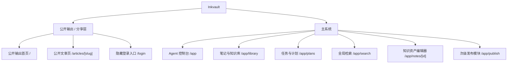
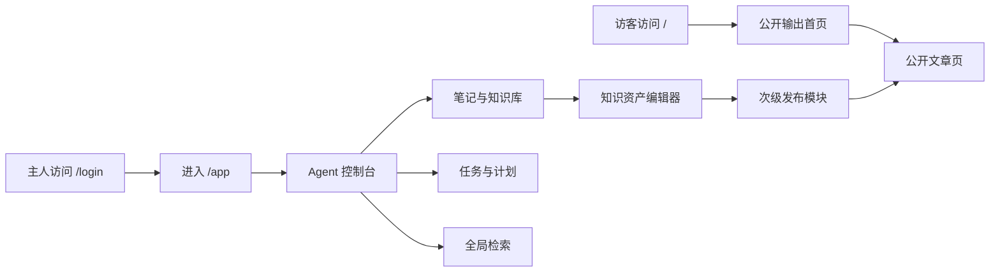

# 信息架构

## 目标

这份文档固定 Inkvault 当前 MVP 的“主系统 + 输出层”结构，确保产品、设计和前端对页面边界保持一致。

## 顶层结构

Inkvault 的长期核心是主系统。当前 MVP 在路由层保留一个公开输出入口，用于承接文章阅读与内容分享：

- 公开输出 / 分享层：对访客开放，只展示作者信息与公开内容
- 主系统：对主人开放，承接 Agent、笔记、任务计划与检索

## 路由规则

### 根路由行为

- 未登录访问 `/`：渲染公开输出首页
- 已登录访问 `/`：自动进入 `/app`

### 公开输出路由

- `/`
  - 目标：展示公开文章、作者信息与项目分享
  - 职责：承接访客对作者、文章和项目链接的第一印象
- `/articles/[slug]`
  - 目标：展示单篇公开文章
  - 职责：提供稳定的阅读入口
- `/login`
  - 目标：主人隐藏登录入口
  - 职责：进入主系统

### 主系统路由

- `/app`
  - 目标：作为主人进入后的第一屏
  - 职责：展示 Agent 控制台、今日上下文与跨模块入口
- `/app/library`
  - 目标：沉淀与浏览知识资产
  - 职责：查看笔记、摘要、标签与归属状态
- `/app/plans`
  - 目标：推进当前事项
  - 职责：组织任务、计划和阶段性执行信息
- `/app/search`
  - 目标：召回上下文
  - 职责：通过关键词重新进入历史笔记和判断现场
- `/app/notes/[id]`
  - 目标：编辑知识资产
  - 职责：承载标题、正文、状态和公开输出发布能力
- `/app/publish`
  - 目标：向公开输出层发布内容
  - 职责：管理哪些内容已发布、哪些内容仍留在主系统

## 导航关系

### 公开输出导航

- 只围绕作者与公开内容组织
- 不暴露主系统入口
- 公开文章详情页可返回公开输出首页

### 主系统导航

- 一级导航固定为：Agent、笔记、任务与计划、检索、发布
- Agent 首页负责总入口，不和笔记页重复职责
- 发布模块保持存在，但不再主导导航层级

## 主链路

## 页面边界

- 公开输出层不承担主系统入口职责
- 主系统不承担面向访客的品牌介绍职责
- Agent 首页负责组织入口，不直接替代笔记与计划模块
- 发布模块负责把内容发布到公开输出层，不负责定义整个产品

## 后续衔接点

- 更深的 Agent 能力优先落在 `/app`
- 更复杂的任务与计划体系优先扩展 `/app/plans`
- 公开输出层只在“公开输出 + 公开文章”框架内增强，不向产品官网演化
