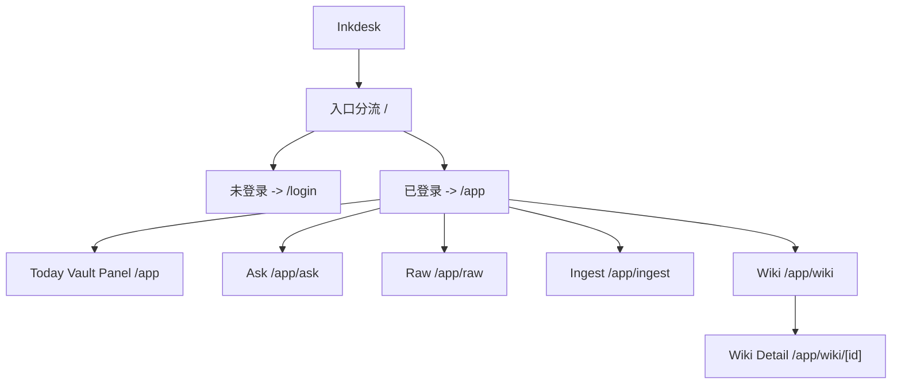
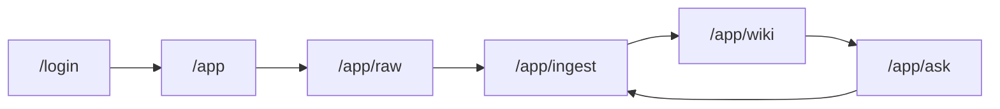

# 信息架构

## 目标

固定当前 vault-first 私有 LLM Wiki 的路由与页面边界。

## 顶层结构

当前产品只有一个私有工作区和一个登录入口：

## 路由规则

### 根路由

- `/`
  - 未登录：重定向到 `/login`
  - 已登录：重定向到 `/app`

### 登录路由

- `/login`
  - 目标：owner 登录入口
  - 边界：只负责登录，不承载公开内容展示

### 私有工作区

- `/app`
  - 目标：认证后的首页
  - 职责：显示 Today Vault Panel、当前研究状态和进入各主模块的入口

- `/app/ask`
  - 目标：研究问答与追问
  - 职责：围绕 wiki 与 raw 发起问题、查看回答、继续追问、生成 writeback 提案

- `/app/raw`
  - 目标：管理原始材料
  - 职责：导入网页、PDF、文本，查看 raw 索引状态

- `/app/ingest`
  - 目标：审阅 AI 提案
  - 职责：接受或拒绝 topic create / patch

- `/app/wiki`
  - 目标：浏览知识页列表
  - 职责：查看已沉淀主题与摘要

- `/app/wiki/[id]`
  - 目标：查看单个知识页详情
  - 职责：阅读 understanding、claims、questions、sources 与研究线程

## 兼容路由

以下旧路由仍保留，但只做兼容跳转：

- `/app/inbox` -> `/app/raw`
- `/app/review` -> `/app/ingest`
- `/app/topics` -> `/app/wiki`
- `/app/sources` -> `/app/raw`

## 导航关系

当前主导航围绕四个一级对象组织：

- 问答
- 资料
- 审阅
- 知识库

它们对应的产品语言分别是：

- `ask`
- `raw`
- `ingest`
- `wiki`

## 主链路

## 页面边界

- 当前没有公开访客页
- 当前没有 `plans`、`search`、`publish`、`settings` 主路径
- `ask` 是研究入口，不替代 `raw`、`ingest` 或 `wiki`
- `wiki` 是沉淀结果，不是原始材料仓
