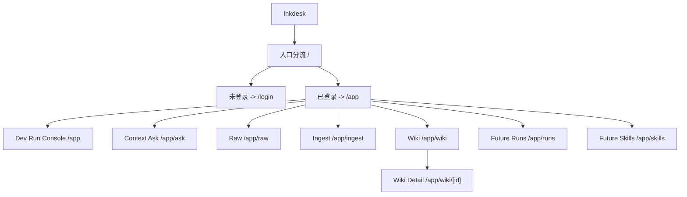
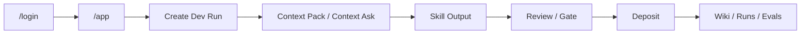

# 信息架构

## 目标

固定 AI 研发自动化控制台的路由与页面边界。

## 顶层结构

当前产品只有一个私有工作区和一个登录入口：

## 路由规则

### 根路由

- `/`
  - 未登录：重定向到 `/login`
  - 已登录：重定向到 `/app`

### 登录路由

- `/login`
  - 目标：owner 登录入口
  - 边界：只负责登录，不承载公开内容展示

### 私有工作区

- `/app`
  - 目标：认证后的首页
  - 职责：显示 Dev Run Console、研发任务阶段状态、待确认输出、知识健康摘要和进入各主模块的入口

- `/app/ask`
  - 目标：Context Ask
  - 职责：围绕当前研发任务查询 wiki 与 raw，查看带引用回答、继续追问、生成 writeback / deposit 提案

- `/app/raw`
  - 目标：管理原始材料和任务证据
  - 职责：导入网页、PDF、文本、PRD、技术材料，查看 raw 索引状态

- `/app/ingest`
  - 目标：审阅 AI 提案
  - 职责：接受或拒绝 topic create / patch、阶段沉淀提案、冲突裁决

- `/app/wiki`
  - 目标：浏览知识页列表
  - 职责：查看已沉淀主题、claim、来源与摘要

- `/app/wiki/[id]`
  - 目标：查看单个知识页详情
  - 职责：阅读 understanding、claims、questions、sources 与研究线程

### 规划中路由

- `/app/runs`
  - 目标：研发任务运行记录
  - 职责：查看 PRD / bug / 改造任务的阶段状态、输出、门禁与沉淀结果

- `/app/skills`
  - 目标：研发 Skill 工作台
  - 职责：浏览和运行技术方案、技术评审、coding、测试准备、问题排查等 Skills

- `/app/health`
  - 目标：质量仪表盘
  - 职责：查看 wiki health、skill health、eval signals 和 run 阻塞原因

## 兼容路由

以下旧路由仍保留，但只做兼容跳转：

- `/app/inbox` -> `/app/raw`
- `/app/review` -> `/app/ingest`
- `/app/topics` -> `/app/wiki`
- `/app/sources` -> `/app/raw`

## 导航关系

当前目标导航围绕五个一级对象组织：

- 任务
- 上下文
- 资料
- 审阅
- 知识库

它们对应的产品语言分别是：

- `runs`
- `context ask`
- `raw`
- `ingest`
- `wiki`

## 主链路

## 页面边界

- 当前没有公开访客页
- 当前没有 `plans`、`search`、`publish`、`settings` 主路径
- `ask` 不是首页主入口，而是研发任务里的上下文查询能力
- `/app` 应表达 Dev Run Console，而不是 Ask-first 工作区
- `wiki` 是沉淀结果，不是原始材料仓
