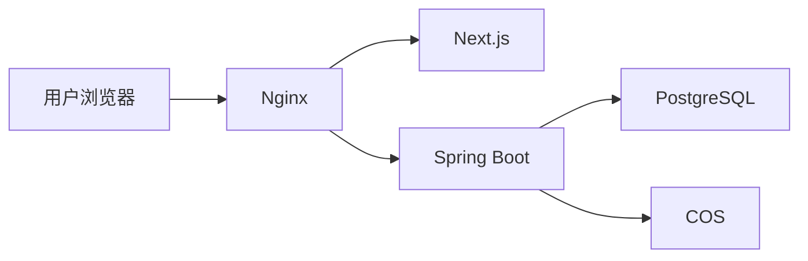

# 部署指南

## 目标

这份文档用于说明 Inkdesk MVP 在国内低成本云环境中的推荐部署方式。默认路线为：

`腾讯云轻量服务器 + COS + Docker Compose + Nginx + HTTPS`

## 部署原则

- 优先保证简单、稳定、低成本
- 只部署 MVP 所需组件
- 文档先行，部署步骤可复现

## 推荐生产组件

- 一台腾讯云轻量服务器
- 一个域名
- 一个 COS 存储桶
- Docker
- Docker Compose
- Nginx
- 前端应用
- 后端应用
- PostgreSQL

## 推荐部署拓扑

## 部署前准备

### 云资源

- 购买腾讯云轻量服务器
- 购买或准备域名
- 创建 COS 存储桶

### 合规事项

- 如果使用国内服务器和国内域名访问，需确认备案流程
- 没有备案前，不要默认公开对外正式访问

### 服务器基础

- 开放 `80`、`443`、`22`
- 安装 Docker
- 安装 Docker Compose

## 部署步骤

### 第一步：准备服务器

- 登录服务器
- 更新基础软件
- 安装 Docker 与 Docker Compose
- 创建项目部署目录

### 第二步：准备环境变量

- 根据 `ops/env-vars.md` 准备生产环境变量
- 不在仓库中保存生产密钥

### 第三步：准备数据库和对象存储配置

- 创建 PostgreSQL 数据库与账号
- 配置 COS 的访问密钥、桶名称和地域

### 第四步：部署应用

- 拉取仓库代码或部署产物
- 启动 Docker Compose
- 确认前端、后端、数据库容器状态正常

### 第五步：配置 Nginx

- 将域名指向服务器
- 配置 Nginx 反向代理
- 将公开请求转发给前端
- 将 `/api/` 请求转发给后端

### 第六步：配置 HTTPS

- 申请证书
- 配置 80 跳转 443
- 验证 HTTPS 可访问

### 第七步：上线验证

- 打开公开首页
- 打开公开文章页
- 通过隐藏入口登录主系统
- 测试检索、上传、发布

## Nginx 路由原则

- `/` 和公开页面走前端
- `/api/` 走后端
- 静态资源可后续接入 COS 域名或 CDN

## 首次上线后的立即事项

- 检查日志
- 检查健康接口
- 检查备份任务
- 记录部署版本

## 非目标

- 当前不部署 Kubernetes
- 当前不拆前后端独立域名
- 当前不做蓝绿发布

## 后续衔接点

- 环境变量见 `ops/env-vars.md`
- 备份恢复见 `ops/backup-restore.md`
- 上线清单见 `delivery/release-checklist.md`
