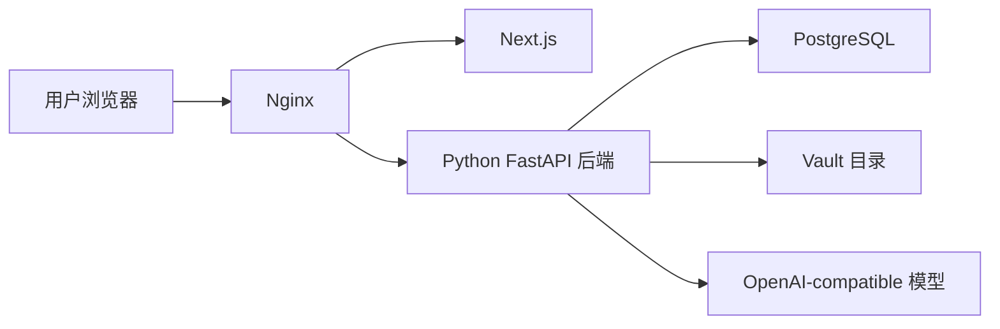

# 部署指南

## 目标

说明 Inkdesk 当前私有 vault-first LLM Wiki 的推荐部署方式。默认路线为：

`单台服务器 + Docker Compose + Nginx + PostgreSQL + 挂载 Vault 目录 + HTTPS`

## 部署原则

- 优先保证简单、稳定、低成本
- 只部署当前主路径需要的组件
- Vault 文件必须可持久化与备份
- 不为当前不存在的公开内容面预留复杂拓扑

## 推荐生产组件

- 一台云服务器
- 一个域名
- Docker
- Docker Compose
- Nginx
- 前端应用
- Python 主后端
- PostgreSQL
- 挂载的 vault 存储目录

## 推荐部署拓扑

## 部署前准备

### 云资源

- 准备服务器
- 准备域名
- 准备 vault 持久化目录或挂载卷

### 合规事项

- 如果对公网开放访问，确认服务器、域名与证书合规要求
- owner 登录入口应保持私有，当前不提供公开内容面

### 服务器基础

- 开放 `80`、`443`、`22`
- 安装 Docker
- 安装 Docker Compose

## 部署步骤

### 第一步：准备服务器

- 登录服务器
- 更新基础软件
- 安装 Docker 与 Docker Compose
- 创建项目部署目录与 vault 数据目录

### 第二步：准备环境变量

- 根据 `ops/环境变量.md` 准备生产环境变量
- 不在仓库中保存生产密钥

### 第三步：准备数据库和 vault

- 创建 PostgreSQL 数据库与账号
- 配置 `INKDESK_DB_URL`
- 配置 `INKDESK_VAULT_ROOT` 指向持久化目录

### 第四步：部署应用

- 拉取仓库代码或部署产物
- 启动 Docker Compose
- 确认前端、后端、数据库容器状态正常

### 第五步：配置 Nginx

- 将域名指向服务器
- 配置 Nginx 反向代理
- 将前端请求转发给 Next.js
- 将 `/api/` 请求转发给 Python 主后端

### 第六步：配置 HTTPS

- 申请证书
- 配置 80 跳转 443
- 验证 HTTPS 可访问

### 第七步：上线验证

- 打开 `/`
- 确认未登录时会进入 `/login`
- 完成 owner 登录
- 测试 `/app/raw`、`/app/ingest`、`/app/wiki`、`/app/ask`
- 检查健康接口和日志

## Nginx 路由原则

- `/`、`/login`、`/app/*` 走前端
- `/api/`、`/health`、`/actuator/health` 走 Python 主后端

## 首次上线后的立即事项

- 检查日志
- 检查健康接口
- 检查 vault 备份任务
- 记录部署版本

## 非目标

- 当前不部署 Kubernetes
- 当前不做多租户
- 当前不提供公开内容发布层

