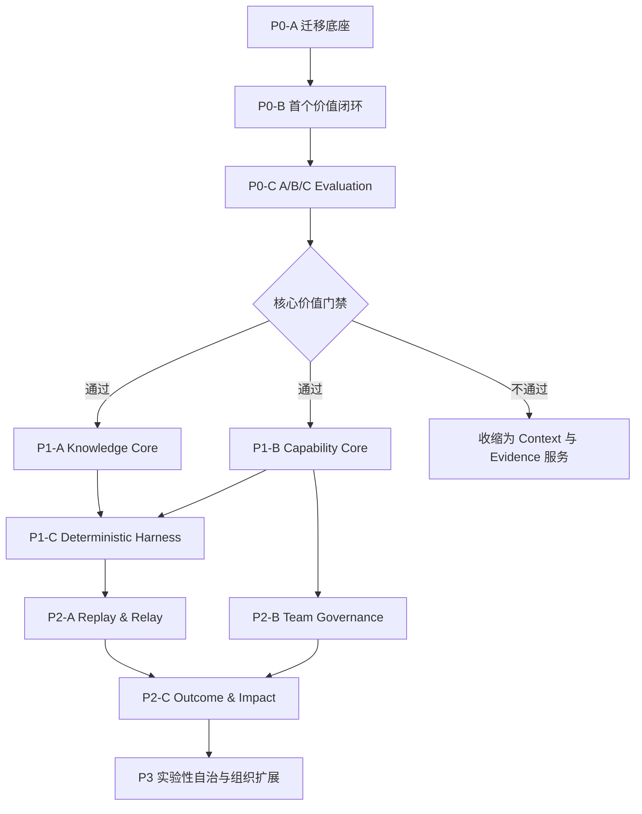

# Inkdesk 团队 AI 研发能力平台总开发路线图

> 日期：2026-07-11
> 状态：已确认；F01 工具与测试已合并，基线捕获和恢复演练待完成
> 上位设计：[`2026-07-11-inkdesk-team-rd-capability-platform-design.md`](../specs/2026-07-11-inkdesk-team-rd-capability-platform-design.md)
> 计划性质：Plan of Plans；定义全局顺序、能力边界和阶段门禁，不在一个计划中实施整个系统
> 协作约束：Codex 维护计划、解释设计并审阅；用户负责编码、失败测试、调试、测试执行和浏览器验收

## 1. 计划权威与适用范围

本文是总设计确认后的唯一前向开发路线图。它取代以下旧文档中的“当前优先级、后续顺序和长期阶段”结论：

- `docs/development/plans/开发计划总指南.md`
- `docs/product/产品路线图.md`
- `README.md` 中按旧单人产品边界描述的后续阶段

旧文档继续用于理解历史决策和当前实现，不再决定未来建设顺序。发生冲突时，遵循以下优先级：

```text
已确认总设计
-> 本路线图
-> 当前激活的小计划
-> 当前实现与历史文档
```

本文覆盖当前仓库的渐进式重构与后续功能建设，不授权一次性重写，也不授权跳过阶段门禁提前建设高自治能力。

Codex 内优先的宿主、执行器与长期演进映射见 [`2026-08-04-inkdesk-codex-integrated-long-term-roadmap.md`](./2026-08-04-inkdesk-codex-integrated-long-term-roadmap.md)。该文件当前是补充演进视图；只有 Windows/CDP Spike 通过并正式修订本路线后，才改变 P0 的权威执行顺序。

## 2. 总目标

使用现有代码作为可迁移资产，把 Inkdesk 逐步演进为：

> personal-first、team-native 的团队 AI 研发能力持续编译与运行平台。

开发顺序围绕一个可证伪的核心假设展开：

```text
PRD
-> Context Pack
-> 技术方案
-> 独立技术评审
-> Baseline / KB / KB+Skills 对照评测
```

只有真实任务证明 Wiki + Skills 带来稳定、可解释且治理成本可接受的提升，才继续扩展 Coding Harness、Capability Replay、团队治理和组织级部署。

### 2.1 不可破坏的产品不变量

- 四条闭环保持独立又互相校准：Knowledge Loop、Capability Loop、Execution Loop、Outcome Loop。
- 所有能力对象支持 Personal、Project、Domain、Organization 四级作用域；早期只开放默认个人和项目体验，数据边界不能写死为单用户。
- 产品形态保持 Agent-native、Web-governed、Git-portable；外部 Agent 是可替换 Executor，不成为长期真相来源。
- Canonical Knowledge 必须经过 Proposal 与 Review；团队默认 Skill、Policy 和 Executor Profile 还必须经过 Evaluation 与 Promotion。
- Harness 是确定性的导演，负责解析、门禁、预算、恢复和回滚，不替 LLM 做领域判断。
- 真实 Outcome 是最终真相；离线 Evaluation、Replay 和 LLM Judge 都不能覆盖生产结果。
- Capability Replay & Relay 是横跨四条闭环的验证层，不演化成第五条孤立工作流。
- Dynamic Harness、自动因果归因、自动晋级和自我修改 Active Capability 在获得实验结果前均属于禁区。

## 3. 当前仓库起点

### 3.1 已有可复用能力

| 能力 | 当前实现 | 路线图处理 |
| --- | --- | --- |
| Knowledge Loop 雏形 | `raw -> ingest -> wiki -> ask -> deposit` | 保留行为，逐步迁入 Knowledge 模块 |
| Dev Run | 六阶段状态机和 `run_events` | 保留 API，升级为 Goal Contract、Artifact、Evidence 和 Manifest 驱动 |
| Skills | 13 个 Skill、SDK、校验器、Registry、Workbench | 升级为版本化、可作用域解析、可晋级的 Capability Registry |
| Hard Gates | `HardGateChecker`，部分 Gate 仅 warning | 迁入 Policy Engine，明确 block / warn / waiver |
| Evaluation 雏形 | Golden Task 与 EvalRun manifest | 扩展为隔离执行、匿名 Submission、Judgment 和 Comparison |
| MCP | `context_pack`、`search`、`deposit`、`health_check` | 保持薄协议，内部切换到新应用服务 |
| Compile | 数据库任务 + 进程内线程队列 | 迁入耐久 Job / Attempt Worker |
| Coding | Claude Agent SDK / CLI、进程内 Session、SSE 权限确认 | 后期迁入 Executor Adapter、沙箱和耐久 Harness |

### 3.2 主要结构风险

| 风险 | 证据 | 计划响应 |
| --- | --- | --- |
| 单文件职责过多 | `research.py` 约 120 KB，混合知识、审阅、问答、健康与映射 | 用新模块绞杀旧服务，不直接“大文件拆分” |
| 执行逻辑耦合 | `stage_actions.py` 同时处理 Skill、Prompt、LLM、Claude、权限和阶段写回 | 先建立 Artifact / Manifest，再提取 Executor 与 Harness |
| API 组合集中 | `main.py` 集中全部路由 | 保持 URL 兼容，按领域逐个迁入 Router |
| 契约重复 | `schemas.py`、`web/lib/types.ts`、`web/lib/research.ts` 持续增长 | 按前端 feature 和后端 module 拆分，契约测试保护迁移 |
| 迁移权威混乱 | 旧 Flyway SQL、`create_all`、运行时 `ALTER TABLE` 并存 | 先统一为 Python 迁移权威，再新增核心表 |
| 运行不耐久 | Compile queue、Coding session 依赖进程内状态 | Evaluation 和 Harness 前建立 Job / Attempt / lease |
| 团队边界缺失 | 当前只有默认 Workspace 和无登录模式 | 早期回填默认 Organization / Space，团队 UI 后置 |
| 贡献知识集中 | Git 身份虽有四个，实际为同一开发者的多个身份 | 每个小计划增加认知地图、契约测试和可交接验收 |

Git 侦察显示 75 次提交，热点包括 `main.py`、`schemas.py`、`web/lib/research.ts` 和 `web/lib/types.ts`；`schemas.py` 与 `research.ts` 同时属于修复热点。重构优先保护这些边界，不以提交次数或文件大小直接推导代码质量。

## 4. 迁移策略

### 4.1 采用绞杀式迁移

```text
现有 API / UI
-> Compatibility Facade
-> 新领域应用服务
-> 新数据模型
-> 切换读路径
-> 停止旧写路径
-> 观察稳定
-> 删除旧实现
```

禁止先复制整套系统再切流。每次只迁移一个业务能力，并保持旧 API 可用，直到对应前端、MCP、测试和数据回填全部完成。

### 4.2 数据迁移采用 Expand -> Backfill -> Switch -> Contract

1. `Expand`：只增加兼容表、列或索引，不删除旧字段。
2. `Backfill`：幂等回填并生成一致性报告。
3. `Switch`：先切读，再停止旧写；避免长期双写。
4. `Contract`：至少经过一个后续计划和恢复演练后，才删除旧结构。

任一阶段发现不可逆差异，立即回到旧读路径；不通过手工修改生产数据“修平”迁移问题。

### 4.3 不先做技术洁癖重构

- 不单独以“拆文件”“改目录”“统一命名”为交付目标。
- 新能力不得继续堆入 `research.py`、`stage_actions.py`、`main.py`、`web/lib/research.ts` 或 `web/lib/types.ts`，兼容适配除外。
- 只有当前小计划触达的旧职责才迁出。
- 每次删除旧代码前必须有行为测试、数据一致性检查和回退路径。

## 5. 目标模块边界

目标仍是模块化单体，不拆微服务。目录按领域组织，模块内部保持轻量；未出现真实复杂度前不创建空层。

```text
server/inkdesk_server/
  api/
    app.py
    dependencies.py
    errors.py
    routers/
  modules/
    spaces/
    knowledge/
    capabilities/
    runs/
    evaluations/
    replay/
    outcomes/
    governance/
  infrastructure/
    db/
    vault/
    jobs/
    object_store/
    connectors/
```

每个领域模块按需要使用以下文件，不要求机械齐全：

```text
domain.py       纯状态、值对象和不变量
service.py      应用用例与事务边界
repository.py   领域需要的持久化接口
models.py       SQLAlchemy 映射
schemas.py      API / 文件契约
events.py       跨模块可观察事件
```

前端逐步迁为：

```text
web/features/
  operations/
  runs/
  knowledge/
  capabilities/
  reviews/
  evaluations/
  replay/
  governance/

web/lib/api/
  client.ts
  errors.ts
```

模块之间通过应用命令、查询接口或领域事件协作。禁止一个模块直接查询另一个模块的内部 ORM 表；跨模块读取必须经公开查询接口或稳定只读投影。

## 6. 小计划契约

每个计划包必须满足：

1. 只有一个主要能力结果，可以跨后端和前端形成纵向切片。
2. 能独立合并、验证、回退，不依赖同批未合并代码。
3. 最多引入一组相关数据库迁移；涉及第二个独立状态机时必须再拆。
4. 明确上游依赖、文件边界、失败测试、验收命令、浏览器流程和范围外事项。
5. 默认控制在 1-3 个用户开发会话；预计超出时在编码前继续拆分。
6. Bug 修复先由用户写失败测试并确认预期失败；生产代码随后只做最小修复。
7. `web/**` 可见变更必须由用户在真实浏览器验收后签收。
8. 计划完成后更新 `cognitive-map.md`，记录“已理解 / 模糊区 / 黑盒区”。

每个计划激活时新建独立文档：

```text
docs/superpowers/plans/YYYY-MM-DD-<plan-id>-<capability>-implementation.md
```

独立文档必须包含精确文件、测试用例、Red-Green 步骤、迁移与回滚、验收证据。本文不把未来数月的行级实现提前冻结；后续计划必须根据前序真实结果重新校准，但不得自行改变本路线图中的能力边界和门禁。

本文共登记 56 个长期计划包。它们不是 56 个同时承诺的功能，也不是预先排满的迭代；当前只激活 P0，P1-P3 必须在前级门禁通过后重新检查必要性、边界和实现文件。

## 7. 优先级

| 级别 | 含义 | 进入条件 |
| --- | --- | --- |
| P0 | 证明核心价值并建立可迁移底座 | 立即执行 |
| P1 | 把验证通过的能力产品化并提高可靠性 | P0 核心价值门禁通过 |
| P2 | Replay、团队治理和 Outcome 闭环 | P1 领域边界与 Promotion 稳定 |
| P3 | 实验性自治和组织级扩展 | P2 有真实使用与生产证据 |

除安全漏洞、数据丢失和阻塞 P0 的缺陷外，不允许用 P1-P3 工作打断 P0。

## 8. 总依赖图



### 8.1 总设计追踪矩阵

| 总设计能力 | 对应计划 |
| --- | --- |
| 四级 Capability Space | F04、C03、T01 |
| Knowledge Compiler 与 Canonical Review | K01-K06 |
| Skill Contract、Registry 与作用域解析 | C01-C04 |
| Executor、权限与失败语义 | C05、H03-H05、T04 |
| Evaluation 与 Promotion | E01-E07、C06 |
| Goal Contract、Run、Artifact 与 Evidence | W01-W04 |
| 首个 `PRD -> Context -> Solution -> Review` 落点 | W05-W08 |
| Deterministic Harness 与耐久执行 | F05、H01-H07 |
| Capability Replay & Relay | R01-R06 |
| Outcome & Impact | W01、O01-O03 |
| Agent / Web / Git 产品形态 | W08、C06、H06、R04、T01 |
| 安全、审计、数据与 Secret 边界 | H03-H05、T03-T04 |
| Local / Team / Organization 部署 | F04、T01、T04、X04 |
| Dynamic Harness、自我改进与跨项目能力 | X01-X03 |

## 9. P0-A：安全迁移底座

| ID | 单一能力 | 依赖 | 主要边界 | 可观察验收 |
| --- | --- | --- | --- | --- |
| [F01](./2026-07-11-f01-current-contract-recovery-baseline-implementation.md) | 当前行为契约与恢复基线 | 无 | `server/tests/**`、`web/tests/**`、`docs/delivery/**` | 用户执行并保存后端、前端、OpenAPI、Vault 备份与数据库恢复证据；Codex 审阅，已知失败单独登记 |
| F02 | Python 数据库迁移权威 | F01 | `server/pyproject.toml`、`server/alembic*`、`db.py` | 空库与现有库升级到同一 schema；后续不再向运行时升级数组新增 DDL |
| F03 | 模块化应用组合壳 | F01 | `main.py`、新 `api/app.py` 与 `api/routers/` | 先迁移 health / vault 路由；OpenAPI、状态码和响应体保持兼容 |
| F04 | 默认 Organization 与 Capability Space | F02、F03 | 新 `modules/spaces/`、身份与空间表、兼容 Workspace Adapter | 现有 Workspace 数据幂等回填到默认组织、个人空间和项目空间；暂不增加登录或团队 UI |
| F05 | Durable Job / Attempt Kernel | F02、F03 | `infrastructure/jobs/`、Compile Worker Adapter | Job、Attempt、lease、heartbeat 和 idempotency key 可持久化；进程重启能接管未完成任务且不重复副作用 |

### P0-A 门禁

- 用户在本机执行现有后端和前端基线，结果有日期、版本和失败说明；Codex 审阅命令、输出和失败分类。
- 数据库与 Vault 至少完成一次备份和恢复演练。
- 新模块模式经过一个无行为变化的路由迁移验证。
- 所有现有数据仍能通过原 API 和 UI 读取。
- 现有 Compile 任务通过 Durable Job Adapter 验证重启恢复和幂等接管。

## 10. P0-B：首个价值闭环

| ID | 单一能力 | 依赖 | 主要边界 | 可观察验收 |
| --- | --- | --- | --- | --- |
| W01 | Goal Contract | F04 | Runs domain、Run API、创建 Run UI | 新 Run 明确目标、受影响对象、技术指标、Outcome / proxy、观察时间和回滚条件；旧 Run 可兼容读取 |
| W02 | Run 状态机与失败语义 v2 | W01 | Runs domain、`run_service.py` 兼容层 | 纯领域测试覆盖合法/非法转换、blocked、failed、cancelled、retry；API 返回稳定原因码 |
| W03 | Artifact 与 Evidence 主干 | F02、W02 | Runs domain、对象存储接口、stage output 适配 | 阶段产物有不可变内容哈希、类型、来源和验证证据；Event 只引用 Artifact，不再是唯一载体 |
| W04 | Capability Manifest | W03 | Runs / Capabilities 边界 | 每次执行记录 Wiki、Schema、Skill、Policy、Executor、Context 和代码版本；缺失版本时明确标记 unknown |
| W05 | Context Pack v2 | W01、W03、W04 | Knowledge query、MCP `context_pack`、Context 阶段 | 输出具备 Token Budget、选择理由、来源、排除项、知识缺口和 Manifest；相同快照可复现选择结果 |
| W06 | Tech Solution Artifact | W05 | `tech-solution` Skill、Executor facade、Solution 阶段 | 方案成为结构化 Artifact，引用真实需求、代码和知识证据，并通过 schema gate |
| W07 | Independent Tech Review Artifact | W06 | `tech-review` Skill、独立执行上下文、Review 阶段 | Review 不读取方案生成者的隐藏会话，独立反查证据并输出分级、可定位、可修正的 Findings |
| W08 | Evidence Review UI | W06、W07 | `web/features/reviews/`、Run 详情、兼容旧页面 | 用户能查看能力版本、证据、差异、风险并执行接受、修改、拒绝；Playwright 验证完整流程 |

### P0-B 门禁

- 一个真实 PRD 能完成 `Goal Contract -> Context Pack -> Tech Solution -> Independent Review`。
- 每个阶段都有 Artifact、Evidence、Capability Manifest 和明确的阻塞/完成状态。
- Review 能指出至少一个带证据的真实问题，或有证据地得出“未发现阻塞问题”。
- 用户能在 Web 中完成审阅，不需要直接修改数据库或事件 JSON。

## 11. P0-C：Evaluation 与核心价值证明

| ID | 单一能力 | 依赖 | 主要边界 | 可观察验收 |
| --- | --- | --- | --- | --- |
| E01 | Golden Task Candidate | W08 | Evaluation domain、Run / Review 转换入口 | 真实失败、人工纠正和代表性成功 Run 可脱敏后进入候选；不能自动成为 Golden Task |
| E02 | EvalSuite 与 Rubric 版本化 | E01、F02 | Git 中定义、数据库索引、Evaluation API | Suite 覆盖正常、边界、失败、安全场景；Rubric 有期望证据、禁止行为和关键 Gate |
| E03 | 隔离 EvalRun | E02、F05 | Evaluation worker、Sandbox Adapter | 每个 Eval Attempt 使用独立输入和输出目录；评测不能修改 Canonical Wiki 或真实仓库，失败保留证据 |
| E04 | Baseline / KB / KB+Skills 变体执行 | E03、W05 | Evaluation runner、Context / Capability overrides | 三组使用同一任务快照、预算和 Executor Profile，差异只来自指定能力组合 |
| E05 | 匿名 Submission 与确定性验证 | E04 | Submission sanitizer、规则和测试执行 | 移除组别与能力标识并生成随机 Submission ID；结构、安全、测试失败在调用 Judge 前确定性落盘 |
| E06 | Judge 与人工分歧复核 | E05 | Judge Adapter、重复评分、人工复核队列 | 生成与评分隔离；重复评分差异超过阈值进入人工复核，Judge 版本和校准结果可追溯 |
| E07 | Comparison、噪声基线与实验报告 | E06 | Comparison service、Evaluation UI、决策报告 | 计算 `sigma0`，关键失败不可被均分掩盖；完成 10-20 个真实任务的 A/B/C 对照和治理成本统计 |

### P0 核心价值门禁

必须同时满足：

1. C 组相对 A/B 在技术事实、需求覆盖、证据、风险与编造率上有超过噪声的稳定提升。
2. 不同成员或 Agent 的结果方差可接受。
3. 生成、审阅、维护和评测总成本低于节省的研发成本。
4. 失败、低分和 Judge 分歧可以追溯并由人工复核。

门禁不通过时，停止 P1-P3，按证据选择以下收缩方向之一：

- 只保留 Context Pack 与 Evidence 服务。
- 更换第一任务类型后重新做小规模实验。
- Evaluation 仅作辅助，不承担自动晋级。
- 降低 Wiki / Skill 治理频率，只沉淀高价值经验。

## 12. P1-A：Knowledge Core

| ID | 单一能力 | 依赖 | 主要边界 | 可观察验收 |
| --- | --- | --- | --- | --- |
| K01 | Source Snapshot 与数据分级 | P0 门禁、F04 | Knowledge domain、Sources API | 来源内容、版本、分类、权限、哈希和采集时间不可混淆；更新创建新 Snapshot |
| K02 | 通用 Proposal / Review 生命周期 | K01 | Knowledge / Reviews module、旧 `review_items` Adapter | Proposal 支持 create / update / merge / deprecate，记录语义差异、影响和决定，不直接改 Canonical |
| K03 | Claim / Evidence / Conflict 版本图 | K02 | Knowledge domain、Wiki detail API | Claim 绑定多条 Evidence、时效和冲突关系；历史版本可追溯，状态转换有领域测试 |
| K04 | Canonical Wiki 投影与重建 | K03 | Vault projector、rebuild command、完整性报告 | 可从结构化对象生成 Markdown，也可验证 Git Markdown 与索引差异；不在本计划决定最终真相反转 |
| K05 | 耐久 Knowledge Compiler | K04、E03 | Compile worker、Knowledge application service | Source 变更幂等地产生 Proposal，并更新所有受影响页面候选；中断可恢复且不静默写 Canonical |
| K06 | Knowledge Health 与新鲜度 Gate | K05、E02 | Health rules、Promotion input、Health UI | 结构、来源、冲突、过期、孤岛、使用与任务提升分别报告；关键 Gate 可阻塞晋级 |

## 13. P1-B：Capability Core

| ID | 单一能力 | 依赖 | 主要边界 | 可观察验收 |
| --- | --- | --- | --- | --- |
| C01 | Skill Contract v2 | P0 门禁 | `inkdesk_skill_sdk`、13 个 Skill 迁移 | Contract 增加版本、作用域、风险、权限、Artifact 输出和 Gate；v1 package 有明确迁移错误 |
| C02 | Capability Registry 与版本生命周期 | C01、F02 | Capabilities domain、Registry API | Draft / Candidate / Active / Deprecated / Rolled Back 转换受控，Active 版本唯一且历史保留 |
| C03 | 四级作用域解析 | C02、F04 | Capability resolver | Personal -> Project -> Domain -> Organization 按显式覆盖规则解析，结果生成可解释 Resolution Trace |
| C04 | Policy、Gate Severity 与 Waiver | C03 | Policy Engine、现有 `HardGateChecker` Adapter | block / warn / info 和限时 Waiver 明确；安全、正确性和数据完整性不可用综合分绕过 |
| C05 | Executor Profile 与 Adapter Contract | C02 | Connectors、LangGraph / Claude 现有实现 Adapter | Executor 能力、成本、权限、数据边界和版本显式；替换执行器不改变 Skill Contract |
| C06 | Capability Diff 与 Promotion Workbench | C02-C05、E07、K06 | Capability UI、Promotion service | 审阅者能比较版本、Eval、Replay 占位、风险和影响，并执行晋级、拒绝、弃用或回滚 |

## 14. P1-C：Deterministic Harness 与受控 Coding

| ID | 单一能力 | 依赖 | 主要边界 | 可观察验收 |
| --- | --- | --- | --- | --- |
| H01 | 固定 Workflow Definition | C06、W08 | Runs / Harness domain、版本化 workflow 文件 | 先表达 Solution -> Review 固定 Playbook；步骤、输入、输出、Gate 和预算显式，不实现 Dynamic Harness |
| H02 | 耐久 Harness Checkpoint | H01、E03 | Harness worker、Job / Attempt | 服务重启后从已提交 Checkpoint 恢复；不可逆步骤不被重复执行 |
| H03 | Connector Gateway 与最小权限 | H02、C04、C05 | Connector registry、SecretRef、Context filter | 所有工具调用经过统一权限决定、审计和数据过滤；密钥不进入 Prompt、日志或 Artifact |
| H04 | 受控 Coding Executor | H03 | 替换 `stage_actions.py` / `coding_session.py` 直接调用、worktree / sandbox | Coding 在隔离工作区执行，工具权限可确认，结果、测试和变更形成 Evidence；失败不污染主工作树 |
| H05 | Retry、Rollback 与 Compensation | H04 | Harness domain、Attempt history | 只有幂等步骤自动重试；回滚/补偿有前置声明、证据和状态，失败历史不覆盖 |
| H06 | Operations Console | H02、H05 | `/operations`、Run timeline、审批与预算 UI | 用户能看到运行、阻塞、Attempt、权限、成本、恢复和回滚，不靠服务器日志操作 |
| H07 | Testing 与 Problem Solve Workflow | H04、C06、对应 EvalSuite | `test-prep`、`test-fix`、`problem-solve` workflow | 每条新增流程先有真实 Golden Tasks 和失败信号，再进入固定 Harness；不扩展通用自治 |

## 15. P2-A：Capability Replay & Relay

| ID | 单一能力 | 依赖 | 主要边界 | 可观察验收 |
| --- | --- | --- | --- | --- |
| R01 | Experience Capsule 封装与 Seal | H02、W04、E07 | Replay domain、Artifact store | Run 可生成不可变 Capsule，包含任务、来源、环境、能力、上下文、证据、Outcome 引用和安全信封 |
| R02 | Replay Readiness 与外部依赖虚拟化 | R01、H03 | Fixture / record-replay Adapter | 系统明确 frozen、simulated、missing 和 not-comparable；生产写操作不能在 Replay 直接执行 |
| R03 | Counterfactual Replay Runner | R02、C06 | Replay worker、Active / Candidate / Baseline variants | 相同 Capsule 可重复运行并输出 improved / regressed / inconclusive / not-comparable |
| R04 | Impact 与 Replay Comparison UI | R03 | `/replay`、Capability impact query | 用户能从 Capability Diff 看到受影响历史任务、证据、成本、回归和置信度 |
| R05 | Relay Clean Room | R01、C05 | Relay challenge、受限 Context | 不同 Executor 或成员在无原会话条件下执行；只暴露授权 Sources 与 Active Capability，并记录求助和隐性上下文依赖 |
| R06 | Capability Transfer Score 与 Promotion Gate | R04、R05、C06 | Transfer assessment、Promotion input | 分项展示正确性、证据、干预、成本和方差；关键失败不可被均分掩盖，且不产生个人排行榜 |

## 16. P2-B：Team-Native Governance

| ID | 单一能力 | 依赖 | 主要边界 | 可观察验收 |
| --- | --- | --- | --- | --- |
| T01 | 成员、角色与完整 Space 管理 | F04、C04 | Identity / Spaces / Governance UI | 团队可管理 Member、Project、Domain、Organization Space；默认最小权限，个人模式仍可独立运行 |
| T02 | 审阅分配与职责分离 | T01、K02、C06 | Reviews queue、assignment policy | Skill Maintainer 不能独立批准自己的高风险版本；知识和能力审阅有 Owner、期限和积压状态 |
| T03 | Audit Trail 与治理导出 | T02、H03 | Governance events、审计查询与导出 | 权限决定、工具调用、审阅、晋级、回滚和生产副作用可按 Space 与 Run 查询并导出，历史不可静默覆盖 |
| T04 | Team Identity、Secret 与数据边界 | T01、T03、H03 | SSO Adapter、Secret Manager、Context filter | Team Self-hosted 支持身份接入、短期 SecretRef 和数据分级执行；Local 不承担同等部署成本 |

## 17. P2-C：Outcome & Impact

| ID | 单一能力 | 依赖 | 主要边界 | 可观察验收 |
| --- | --- | --- | --- | --- |
| O01 | ChangeSet / Deployment / ObservationWindow 手工关联 | W01、H04 | Outcomes domain、Run UI | 用户可把交付、环境、预期结果和观察窗口关联到 Run；无业务指标时明确标记 proxy |
| O02 | Metric、Feedback、Incident 与 Rollback 观察 | O01 | Outcome connectors、manual fallback | 在自动连接器缺失时仍能人工记录；结果区分 validated / regressed / inconclusive |
| O03 | ImpactAssessment 与 Capability Feedback | O02、C06、R04 | Outcome -> Capability events | 真实回归能生成 Golden Candidate、标记 Claim 重审、降低自治、回滚版本；`production-proven` 只由真实结果授予 |

## 18. P3：实验性能力

| ID | 单一能力 | 依赖 | 主要边界 | 可观察验收 |
| --- | --- | --- | --- | --- |
| X01 | 跨项目 / Domain 能力发现 | C03、T01、K04 | Resolver、权限过滤 | 跨 Space 结果可解释、可拒绝且不泄露未授权知识 |
| X02 | Dynamic Harness 对照实验 | H07、R03、E07 | Experimental workflow resolver | 与固定 Playbook 在同一 Suite 对照；未显著提升时保留固定流程 |
| X03 | 自我改进 Proposal Engine | O03、R03、C06 | Improvement candidate generator | 系统只生成 Skill / Policy / Eval 候选，不能自动修改 Active Capability |
| X04 | Organization 部署强化 | T04、O03 | HA Worker、KMS、数据驻留、审计集成 | 只有团队自托管真实负载证明需要时才进入高可用和组织级隔离建设 |

## 19. 阶段门禁

| Gate | 通过条件 | 不通过动作 |
| --- | --- | --- |
| G0 迁移安全 | 基线、恢复、迁移权威、默认 Space 全部验证 | 停止功能开发，先修复可恢复性 |
| G1 首个闭环 | 真实 PRD 的四阶段 Artifact / Evidence / Review 可操作 | 不进入完整 Evaluation，修复闭环 |
| G2 核心价值 | 10-20 个任务稳定提升且治理成本可接受 | 收缩产品或更换验证任务 |
| G3 Knowledge / Capability | Canonical、Registry、Scope、Policy、Promotion 可追溯 | 不接入 Coding Harness |
| G4 Harness 安全 | 恢复、权限、沙箱、重试和回滚验证通过 | 只保留只读与人工执行 |
| G5 Replay / Team | Capsule 可重放、Relay 有效、治理不伤害成员 | Replay 仅作诊断，Team 降级为轻治理 |
| G6 Outcome | 真实结果能关联且可反向修正能力 | 保留人工确认，不做自动归因 |

## 20. 前三个月建议节奏

前三个月只承诺完成 P0 的学习与验证，不以“功能数量”作为成功标准。

```text
第 1-2 周   F01-F05：迁移安全、架构入口、数据演进、耐久任务
第 3-4 周   W01-W04：Goal、状态机、Artifact、Manifest
第 5-6 周   W05-W08：Context、Solution、Review、Web 审阅
第 7-8 周   E01-E03：Golden、Suite、耐久隔离运行
第 9-10 周  E04-E06：三组执行、匿名验证、Judge 复核
第 11-12 周 E07：噪声基线、真实实验、继续/收缩决策
```

这是学习顺序，不是交付工期承诺。任一小计划超过三个开发会话仍无法形成独立验收，应暂停并进一步拆分，而不是压缩测试或扩大 Codex 代写范围。

## 21. 每个小计划的协作循环

1. Codex 根据本路线图编写当前小计划的详细实施文档，解释相关旧代码和目标边界。
2. 用户确认目标、约束和可观察验收标准。
3. 用户先写失败测试并执行，确认失败原因与目标一致。
4. 用户实现最小生产变更，分享 diff 和验证输出。
5. Codex 审阅正确性、领域设计、安全、测试质量和学习要点。
6. 用户修订并重新运行验证。
7. `web/**` 变更由用户和 Codex 共同在真实浏览器检查后签收。
8. 更新认知地图和计划状态，再激活下一个计划。

同一时间只允许一个小计划处于 `in_progress`。计划之间不得用未提交文件、手工数据库状态或聊天上下文作为隐式依赖。

## 22. 验证命令基线

实际命令以激活计划为准；下面是全量候选，不要求每个小计划全部运行。

```powershell
# 后端：用户执行
cd server
python -m pytest

# Skill SDK：用户执行
python -m pytest tests/test_skill_sdk.py tests/test_skill_loader.py

# 前端：用户执行
cd web
npm test
npm run typecheck
npm run lint
npm run build

# 用户可见流程：用户执行，且按仓库约束串行
npm run e2e
npm run e2e:fullstack
```

数据库迁移、Worker 恢复、Sandbox、Replay 和安全计划必须增加该能力自己的故障注入或恢复命令，不能用普通单元测试替代。

## 23. 当前激活计划

路线图已经确认，当前只激活 [`F01 当前行为契约与恢复基线`](./2026-07-11-f01-current-contract-recovery-baseline-implementation.md)。F01 工具与测试已通过 PR #4 合并，详细计划已经回答：

- 当前哪些 API 和浏览器流程属于必须保留的行为。
- 用户当前能稳定运行哪些测试，哪些失败是已知基线。
- PostgreSQL 与 Vault 如何备份、恢复和校验一致性。
- OpenAPI、数据库 schema 和关键示例数据如何形成迁移前快照。
- 哪些旧实现明确只是兼容层，不应被测试永久固化。

F01 不修改产品行为，不创建新领域表，也不开始 UI 重构。

F01 尚未完成：只有用户执行一次完整 `capture-baseline.ps1 -Mode all`，保存真实测试、备份、隔离恢复和校验证据，并经 Codex 审阅通过后，才能解锁 F02/F03。

## 24. 最终完成语义

总路线图完成不等于“所有表格已打勾”。Inkdesk 只有在以下事实成立时才达到总设计目标：

- 真实任务持续证明 Wiki、Skill 和 Harness 的净收益。
- 一个成员解决的问题能被另一个成员或 Agent 复现。
- 每次交付使用的能力、证据、放行原因和真实结果均可说明。
- 生产回归会反向修正知识、评测、能力版本和自治等级。
- 团队治理成本低于节省的研发成本。
- 系统越用越可靠，而不是只积累更多页面、Prompt、事件和评分。
