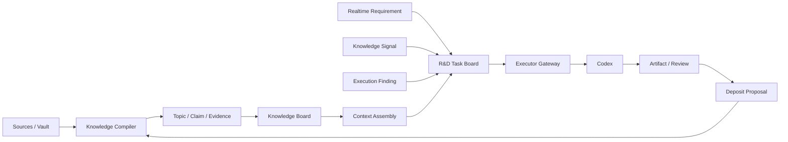

# Inkdesk 知识优先、Codex 后置长期演进路线图

> 状态：产品方向修订版，2026-08-04
>
> 作用：把 Inkdesk 的知识看板、研发任务看板和 Codex 接入放入同一条有门禁的长期路径。
>
> 说明：Windows/CDP Spike 和 Dev Run 基础实现仍是有效技术资产，但不再决定当前产品优先级。

## 1. 战略调整

Inkdesk 当前先解决研发知识的理解、可信度和复用问题，再承接多来源研发需求，最后接入 Codex 执行。

```text
Sources / Wiki / Decisions / Code
  -> Topic Knowledge Board
  -> Briefing / Evidence / Health
  -> Context Assembly
  -> Multi-source R&D Task Board
  -> Codex Execution / Review
  -> Knowledge Deposit Proposal
```

职责边界：

- 知识看板拥有 Topic、Claim、Evidence、Source、Conflict 和 Open Question；
- 任务看板拥有多来源任务、执行状态、风险、下一步和 Review；
- Context Pack 连接知识与执行，是执行门禁，不是建卡门禁；
- Codex 是后续宿主和执行器，不是产品业务真相；
- AI 可以执行和提出知识变更，不能自行批准正式知识或最终完成。

## 2. 从 dashi 吸收什么

dashi 证明了 Codex 内全工作区任务板、密集卡片、过滤、详情和会话绑定的可用性，也证明 CDP/DOM/进程适配需要持续维护。

| dashi 能力 | Inkdesk 采用方式 | 时机 |
| --- | --- | --- |
| 密集任务卡、状态列、筛选、详情 | 用于研发任务执行工作面 | K4 |
| 任务绑定原生对话 | 绑定 Task/DevRun 和 Context Pack | K5 |
| 全工作区 iframe 与恢复机制 | 作为独立 Host Adapter | K5 |
| Skill/CLI 和 `codex exec --json` | 调用同一应用服务和 Executor Adapter | K5 |
| 自动认领、额度和通用 Workflow | 只在评测、安全和真实负载支持时建设 | K5 之后 |

dashi 不决定 K1-K2 的知识看板形态。Inkdesk 的主题卡是知识对象，不应套用 `Todo/Doing/Done`；图谱也只是主题详情的探索辅助。

## 3. 长期目标架构



部署保持两个明确阶段：

- Local：独立 Web、本地文件/SQLite、回环 API、单用户；
- Team：PostgreSQL、共享控制面和 Artifact Store，本地 companion 负责仓库、worktree、Codex 和 Secret。

本地与团队环境通过显式导出、校验和导入迁移，不建立实时双写。

## 4. 演进阶段

### K0：产品与知识模型校正

目标：统一产品文档、领域模型和页面入口。

主要交付：

- `Knowledge Context-first` 产品叙事；
- `/app/wiki` 作为当前入口，graph 降为探索视图；
- Topic、Claim、Evidence、KnowledgeSignal、Task、ContextPack 和 KnowledgeGap 边界；
- dashi/Codex 技术资产移至 K4-K5；
- 保留现有代码和数据，不恢复已删除模块。

退出门禁：产品愿景、MVP、路线图、领域模型和本路线图不存在 Dev Run-first 冲突。

### K1：可用的主题知识看板

目标：让研发人员围绕模块、业务概念和历史决策获得带来源的主题简报。

主要能力：

- 主题卡：当前理解、决策、文档、代码、来源、更新时间、问题和健康信号；
- 主题搜索和 briefing；
- 来源、原文和关系图跳转；
- 文件变化后的索引刷新；
- `/api/knowledge/topics`、search、briefing、sources 和 stream；
- 独立 Web 浏览器验收。

退出门禁：

- 三类真实查询均能生成可用简报；
- 来源和不确定性可追溯；
- 无来源结论不会被包装为事实；
- graph、列表、详情和原文形成完整导航。

### K2：证据与知识健康

目标：让系统解释哪些知识值得相信、哪些需要复核。

主要能力：

- Claim/Evidence/Source 定位；
- stale、unsupported、conflicting 和 open question；
- KnowledgeSignal、健康筛选和主题汇总；
- 补证、冲突处理、更新和 Review-first 提案；
- AI 写入边界和审计。

退出门禁：

- 每类信号都能定位具体内容；
- 复核失败或被拒绝不会污染正式知识；
- 真实内容抽查能解释来源、状态和更新时间。

### K3：多来源研发需求与上下文装配

目标：让实时需求、知识信号、执行发现和人工输入进入统一研发任务模型。

主要能力：

```text
originType = realtime_requirement | knowledge_signal | execution_finding | manual
contextStatus = pending | searching | ready | gap | failed
```

- 实时需求立即进入 `Backlog`，建卡不要求知识关联；
- 自动搜索主题、决策、文档和代码路径；
- 生成 Context Pack 或明确 Knowledge Gap；
- 知识信号任务保留到 Claim/Evidence/Source 的完整回链；
- `pending/searching/failed` 禁止进入 `Ready` 或 `Doing`；
- Knowledge Gap 可生成补证事项。

退出门禁：

- 四类来源都能可靠建卡；
- 无知识不阻塞建卡，但不会被静默忽略；
- 每个进入执行的任务都有版本化 Context Pack 或 Knowledge Gap；
- 任务状态变化不改变知识状态。

### K4：dashi 式研发任务看板

目标：把多来源研发事项组织成高密度、可扫描、受控推进的执行工作面。

主要能力：

- `Backlog -> Ready -> Doing -> Review -> Done`，支持 `Blocked`；
- 密集卡片、筛选、排序、详情和受控拖拽；
- 来源、上下文、优先级、风险、负责人和下一步动作；
- 知识、需求、代码、证据和执行记录互链；
- 人工 Review 与完成门禁；
- DevRun 作为任务的执行记录，而不是产品首页的唯一对象。

退出门禁：

- 不同来源的真实任务可在同一看板管理；
- 卡片可解释上下文是否可用及为什么被阻塞；
- 任务详情可打开相关主题、Context Pack 和证据；
- 产品没有扩展为行政、销售或通用 issue tracker。

### K5：Codex 执行与宿主接入

目标：让 Codex 使用经过装配的上下文执行任务，同时保持独立 Web 和人工门禁。

主要能力：

- Windows Host Adapter、全工作区 iframe 和独立 Web 降级；
- Skill/CLI、会话、仓库、分支和 worktree 绑定；
- `codex exec --json` session、attempt、interrupt、resume 和事件流；
- Context Pack 注入与 Knowledge Gap 明示；
- Artifact/Evidence：可见回答、命令、文件变更、测试和人工决定；
- 执行结果 Review 和知识 Deposit Proposal；
- CDP、回环 API、进程、Secret 和沙箱安全边界。

退出门禁：

- 真实任务能从 Backlog 经上下文装配、执行和 Review 到 Done；
- Codex 得到的上下文可追溯且不包含未授权秘密；
- 重启和中断不会丢失任务或静默完成 Attempt；
- Codex/DOM/CDP 失效时独立 Web 完整可用；
- 正式知识和最终完成仍需人工决定。

### L1：Evaluation 与可靠 Harness

目标：用真实证据判断哪些执行能力可以复用或提高自治度。

主要能力：Durable Attempt、Artifact/Evidence、Golden Tasks、Context/Skill 对照、固定 Playbook、权限和回滚。未通过评测的能力不能自动晋级。

### L2：团队与云控制面

目标：在本地代码和 Secret 不上传云端的前提下，共享任务、知识、评测和审阅。只有本地单用户闭环形成真实高频价值后才启动。

### L3：Outcome、Replay 与多执行器

目标：让真实交付结果反向修正知识和能力，并验证能力能否跨成员、项目和执行器迁移。自我改进只能生成 Proposal。

## 5. 依赖关系

```text
Knowledge Board
  -> Evidence / Health
  -> Multi-source Task + Context Assembly
  -> R&D Task Board
  -> Codex Host / Executor
  -> Evaluation / Fixed Harness
  -> Team / Cloud
  -> Outcome / Replay / Multi-executor
```

禁止提前建设：

- 主题简报未可用，不用完整任务看板掩盖知识内容缺口；
- 证据边界未稳定，不开放 Agent 直接写正式知识；
- Context Pack/Knowledge Gap 未稳定，不推进自动执行；
- 任务高频路径未验证，不把 CDP 嵌入写成核心产品承诺；
- 固定 Playbook 未证明价值，不建设通用 Workflow 画布或 Dynamic Harness；
- 单人本地价值未成立，不建设团队云控制面。

## 6. 当前技术资产如何处理

已完成的 Windows/CDP Spike、SQLite Dev Run、CLI/Skill 和 `/app/runs` 不删除：

- CDP 兼容性报告和 Host Adapter ADR 作为 K5 基线；
- Dev Run 数据模型作为 K3-K4 候选基础，按新 Task/Context 边界演进；
- `/app/runs` 暂不替代 `/app/wiki` 主入口；
- 独立 Web 保持可用；
- 后续实现不得覆盖或批量恢复已有删除代码。

## 7. 衡量指标

| 阶段 | 首要指标 |
| --- | --- |
| K1 | 简报命中率、来源覆盖率、找到有效上下文时间 |
| K2 | 健康信号定位率、误报率、复核完成率、静默写入次数 |
| K3 | Context Pack 就绪率、Knowledge Gap 明确率、执行前失败率 |
| K4 | 建卡时间、阻塞原因可见率、Review 返工、上下文使用率 |
| K5 | 事件完整率、异常恢复率、执行上下文可追溯率、安全事件 |
| L1+ | 评测提升与噪声比、重复副作用、回滚成功率、真实结果改善 |

## 8. 风险与收缩策略

| 风险 | 观察信号 | 收缩动作 |
| --- | --- | --- |
| 知识看板退化为文件列表 | 用户仍需逐个打开文档拼上下文 | 收缩视觉范围，优先修正 briefing、来源和搜索 |
| 图谱抢占主体验 | 节点很多但不能回答当前理解 | 将 graph 固定为详情辅助视图 |
| 任务看板过早泛化 | 出现大量与研发无关字段和工作流 | 保留研发来源、Context Pack 和 Review 核心 |
| Context Pack 噪声过大 | 用户或 Agent 频繁忽略上下文 | 记录引用使用情况并限制包体，明确 gap |
| Codex DOM/CDP 频繁失效 | 升级后反复修复宿主 | 降级到独立 Web + Skill/MCP |
| 自动化扩大风险 | 权限、审计或回滚覆盖不足 | 保持人工执行或固定低风险步骤 |
| Evaluation 无法证明提升 | 差异不超过噪声 | 收缩为 Knowledge Context + Evidence + Review 产品 |

## 9. 近期执行顺序

1. 完成 K0 文档和领域模型校正；
2. 盘点现有 wiki/graph/search 能力与 K1 缺口；
3. 为主题简报和来源追溯定义最小只读接口；
4. 实现并用真实项目内容验收 K1；
5. 增加 K2 证据和健康复核；
6. 通过门禁后再调整现有 Dev Run 模型进入 K3；
7. 最后恢复 dashi 看板形态和 Codex Host/Executor 工作。
