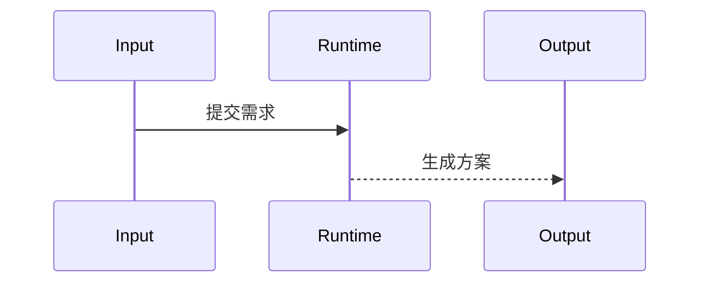

# 技术方案文档

> 由 tech-solution 按方案模板生成。

来源需求：[[需求相对路径|需求标题]]

## 1. 方案概述

- **目标**：[一句话——要解决什么问题]
- **范围**：[做什么，不做什么]
- **约束**：[时间/资源/兼容性约束]

## 2. 现有系统调研

- **相关模块**：[受影响的现有模块，及其当前状态]
- **已有接口**：[需要调用的已有接口]
- **KB 参考**：[wiki 中相关的设计决策和约束](wiki 页面引用)

## 3. 方案设计

### 3.1 架构概览
[文字描述整体架构]

### 3.2 模块职责
| 模块 | 职责 | 输入 | 输出 |
|------|------|------|------|
| ... | ... | ... | ... |

### 3.3 接口设计
每个对外接口：
- **路径/签名**
- **输入**（类型 + 约束）
- **输出**（类型 + 含义）
- **错误**（可能的错误情况和处理）

### 3.4 数据流
1. [步骤 1] — 数据从 [来源] 进入
2. [步骤 2] — 经过 [处理]
3. [步骤 3] — 最终落到 [目标]

## 4. 风险与假设

| 风险 | 影响 | 缓解措施 | 状态 |
|------|------|---------|------|
| [风险描述] | 高/中/低 | [如何减轻或检测] | 待确认 / 已解除 |

## 5. 测试范围建议

- **单元测试**：[关键逻辑路径]
- **集成测试**：[跨模块/跨系统的点]
- **验收点**：[可测量的 pass/fail 条件]

## 6. 信息缺口

- [ ] [缺少的信息] — 影响：[影响什么决策]
