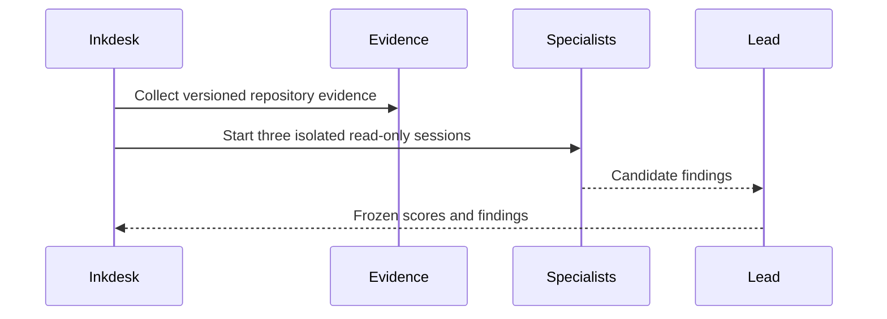

# inkdesk Harness Audit

> Frozen at the repository HEAD shown below.

- Run: `run-eb8ea5af85824f46`
- Repository HEAD: `cc1d1e7624a967b04fd1a9ef5365a5263589bae8`
- Generated: `2026-07-31T17:13:27.574765+00:00`
- Support track: Reconciled from three specialist outputs (Codebase Onboarding Engineer, Test Automation Engineer, AI-Generated Code Security Auditor) against the frozen Evidence Bundle (6 envelopes, session evidence unavailable). Deduplicated 3 CI-pipeline-absence findings into 1 merged finding (F-001). Rejected 1 speculative credential-embedding claim (Security F-003) because openai.yaml file contents are unobserved and the consequence is conditional on unconfirmed facts. Preserved 4 additional distinct findings with non-overlapping causal chains and owners. Scored all five dimensions independently on mechanism evidence, not finding counts.
- Session evidence: `unavailable`

## Five-Dimension Score

| Dimension | Score |
| --- | --- |
| Task Understanding | 3 / 4 |
| Controlled Execution | 2 / 4 |
| Change Validation | 3 / 4 |
| Reliable Delivery | 1 / 4 |
| Learning Capture | 2 / 4 |

## F-001: No automated CI/CD pipeline exists despite 57 tracked test files and documented verification steps

- Dimension: Reliable Delivery
- Severity: high
- Confidence: high
- Owner: Repository maintainers / platform engineering
- Consequence: All six verification commands (pytest, npm test, typecheck, lint, build, e2e) require manual developer invocation on every change. Test execution health — pass/fail status, flakiness, coverage gaps, runtime regressions — is entirely invisible. Regressions can accumulate undetected across commits and pull requests, undermining the reliability of the delivery pipeline.
- Cause chain: The repository contains 0 CI workflow files (E-26813aa1db3c). README.md (E-9f02335dfb7b) documents verification as sequential manual CLI commands, and no pipeline configuration translates those commands into automated execution. No test result artifacts (JUnit XML, coverage reports, execution logs) are produced or stored.
- Evidence: E-26813aa1db3c, E-9f02335dfb7b
- Expected artifact: A CI workflow configuration file (e.g., .github/workflows/ci.yml) that automatically runs pytest, npm test, npm run typecheck, npm run lint, npm run build, and npm run e2e on pull requests and merges to the main branch, with test result reports stored as pipeline artifacts.
- Repair scope: Add CI workflow configuration in the appropriate directory for the hosting platform. Include jobs for server tests (pytest --junitxml), web tests (npm test with JSON reporter), typecheck, lint, build, and e2e. Configure triggers for PR events and main-branch commits. Publish test and build results as pipeline artifacts.
- Verifiers: CI workflow file exists in the expected directory, CI pipeline runs successfully on the latest commit, Pull requests trigger automated checks that block merge on failure, All six verification steps documented in README are covered by CI jobs, Test execution reports are accessible as pipeline artifacts after each run
- Status: open

## F-002: Cognitive map learning artifact mandated by CLAUDE.md but not evidenced in any envelope

- Dimension: Learning Capture
- Severity: medium
- Confidence: medium
- Owner: User (student) and Codex (mentor) jointly
- Consequence: The three-month mentorship-first learning sprint defined in AGENTS.md (E-64c7395f32f1) lacks a documented central learning artifact. Knowledge gained during pair-programming sessions, architecture decisions, and skill development may be scattered or lost, undermining the explicit learning goal of building deep practical understanding in agent observability, evaluation, and security governance.
- Cause chain: CLAUDE.md (E-47f9ae28748c) explicitly requires that cognitive-map.md at the project root be updated after every non-trivial task. However, cognitive-map.md does not appear in the agent customization asset inventory excerpt (E-7753cb7acb76) or the delivery asset inventory (E-26813aa1db3c). Either the file was never created, is stored outside the captured evidence scope, or is excluded by .gitignore.
- Evidence: E-47f9ae28748c
- Expected artifact: cognitive-map.md at the project root containing structured learning entries that map concepts explored, decisions made, and skills developed during the sprint, updated after each non-trivial task as prescribed by CLAUDE.md.
- Repair scope: Create cognitive-map.md at the repository root with an initial structure capturing the current learning state. Establish a habit of updating it after each non-trivial task as prescribed by CLAUDE.md. Determine whether the file should be tracked in version control or maintained separately, and ensure its location matches the CLAUDE.md reference.
- Verifiers: cognitive-map.md exists at the repository root, File contains entries reflecting recent non-trivial task work reflected in git history, CLAUDE.md reference to cognitive-map.md resolves to the actual file location, File shows evidence of updates aligned with task closure workflow
- Status: open

## F-003: Agent skill configurations are tracked but their runtime activation status is undocumented

- Dimension: Controlled Execution
- Severity: medium
- Confidence: medium
- Owner: Skill authors / platform team
- Consequence: Skills such as answer-from-wiki, coding, deposit-answer, and learn-from-session have complete agent configurations (SKILL.md, contract.json, agents/openai.yaml, references/) in the vault, but the README (E-9f02335dfb7b) documents only Observer, Indexer, and tech-solution Engine as delivered in v0.1.0. Users or downstream tools may attempt to invoke skills that are not yet integrated into the runtime, leading to failures or unexpected behavior at the /api/skills/{skill_id}/stream endpoint.
- Cause chain: The agent asset inventory (E-7753cb7acb76) shows 20 tracked skill assets with complete configurations across .claude/skills/ and server/vault/skills/. However, README.md (E-9f02335dfb7b) explicitly defers MCP, the full tech-review→coding→test execution chain, and source AST graph to later milestones. There is no manifest or documentation indicating which of the 20 configured skills are active in the current runtime and which are future-scoped scaffolding.
- Evidence: E-7753cb7acb76, E-9f02335dfb7b
- Expected artifact: A skill inventory document or an activation-status field in each skill's contract.json that clearly indicates whether the skill is active, experimental, or future-scoped in the current deployment, aligned with the v0.1.0 scope boundaries stated in README.
- Repair scope: Add an activation-status indicator to each skill's contract.json or maintain a separate skill inventory document (e.g., docs/skill-status.md). Verify that the /api/skills/{skill_id}/stream endpoint correctly reports availability for each skill based on its activation status. Mark future-scoped skills explicitly so they are not discoverable as operational through the API.
- Verifiers: Each of the 20 tracked skills has a documented activation status, Inactive or future-scoped skills are clearly distinguishable from operational ones in API responses, API endpoint accurately reflects skill availability for all configured skills, Documentation aligns with the v0.1.0 scope boundaries stated in README
- Status: open

## F-004: Feature merges occur without verifiable test execution or automated quality gates

- Dimension: Change Validation
- Severity: medium
- Confidence: high
- Owner: Development team with Codex mentorship oversight
- Consequence: Feature PRs can be merged without observable evidence that tests passed. The test-first policy mandated in AGENTS.md (E-64c7395f32f1) — 'write the failing test first, confirm it fails for the expected reason, then fix the bug' — is unenforceable. The team cannot distinguish between verified and unverified merges in the git history, and regressions introduced in feature work may go undetected until manual discovery.
- Cause chain: Git log (E-c5dc1860e6d8) shows feature merges for PR #17 (headless graph dashboard) and PR #18 (MVP engine closure) completing v0.1.0 scope. Zero CI workflows exist (E-26813aa1db3c) to gate those merges. README.md (E-9f02335dfb7b) lists verification commands as manual CLI steps, but no evidence ties execution of those commands to the merge events. No branch protection rules are evidenced.
- Evidence: E-c5dc1860e6d8, E-26813aa1db3c, E-9f02335dfb7b, E-64c7395f32f1
- Expected artifact: Branch protection rules requiring CI status checks (including test execution) to pass before merge, or documentation of an approved manual-verification exception process with sign-off artifacts for the mentorship sprint period.
- Repair scope: Configure branch protection on the main branch to require CI checks to pass before merge. Ensure the CI pipeline includes the full test suite. If manual verification is intentionally used during the mentorship sprint, document the policy explicitly and create a verification sign-off artifact (e.g., PR comment template with checklist) that references specific test execution output.
- Verifiers: Branch protection rules prevent merging when CI checks fail or are absent, PR status panel shows test results before merge button is available, Merged commits in git log are traceable to a passing CI run or a documented manual verification sign-off, AGENTS.md test-first policy has a corresponding enforcement or documented exception process
- Status: open

## F-005: Skill execution API endpoint lacks documented authentication or authorization controls

- Dimension: Controlled Execution
- Severity: medium
- Confidence: medium
- Owner: Codex (architecture reviewer) — to define auth requirements; User (implementer) — to add middleware and tests
- Consequence: Any process on the local host — or any actor who can reach the port if the 127.0.0.1 bind address is ever relaxed — can invoke arbitrary registered skills via POST /api/skills/{skill_id}/stream without credentials. If skills carry provider API keys (inferred from the presence of openai.yaml configuration files in E-7753cb7acb76), this permits unauthorized consumption of paid model resources and potential data exfiltration through skill output.
- Cause chain: The API surface is defined in README.md (E-9f02335dfb7b) with no mention of authentication middleware, tokens, or session validation for any endpoint including /api/skills/{skill_id}/stream. AGENTS.md (E-64c7395f32f1) focuses on mentorship workflow and secret-hygiene rules but omits access-control requirements for the skill runtime. The localhost-only bind is a network-layer mitigation, not an application-layer control, and may be inadvertently changed in deployment or containerized environments.
- Evidence: E-9f02335dfb7b, E-64c7395f32f1, E-7753cb7acb76
- Expected artifact: Authentication middleware (e.g., FastAPI dependency) applied to /api/skills/* routes, with a documented auth scheme in README or a dedicated security document, and a test that verifies 401/403 responses for unauthenticated requests.
- Repair scope: server/ — add auth dependency to skill router covering all /api/skills/* routes; README.md — document the auth mechanism and how to configure credentials; server/tests/ — add auth rejection test case following the existing invalid-skill fixture pattern.
- Verifiers: Run the server and confirm POST /api/skills/{skill_id}/stream returns 401 without valid credentials, Review that the auth dependency is applied to all /api/skills/* routes, not only the stream endpoint, Check that auth test fixtures exist in the test suite alongside existing invalid-skill fixtures, README documents the auth scheme and credential setup
- Status: open

## F-006: No automated security scanning — dependencies and secrets are unverified at commit time

- Dimension: Reliable Delivery
- Severity: high
- Confidence: high
- Owner: User (implementer) — to configure CI pipeline and pre-commit hooks; Codex (reviewer) — to approve tool selection and verify coverage
- Consequence: Vulnerable or malicious dependencies can enter the codebase undetected through either the Python (server/) or JavaScript (web/) dependency trees. Committed secrets, despite the AGENTS.md 'never commit secrets' rule (E-64c7395f32f1), have no automated block. The recent manual 'upgrade frontend security dependencies' commit (E-c5dc1860e6d8) demonstrates that security updates rely entirely on human memory, creating a window where known-vulnerable packages remain in production builds until someone remembers to check.
- Cause chain: E-26813aa1db3c reports zero CI workflow files. AGENTS.md (E-64c7395f32f1) encodes a 'never commit secrets or credentials' rule and a '.env*.example synchronization' requirement but provides no enforcement mechanism such as pre-commit hooks or secret scanning. The git log (E-c5dc1860e6d8) shows a manual security dependency upgrade as the only security-adjacent delivery signal. There is no evidence of Dependabot, Snyk, pip-audit, npm audit, or pre-commit secret-scanning integration.
- Evidence: E-26813aa1db3c, E-c5dc1860e6d8, E-64c7395f32f1
- Expected artifact: A CI workflow file (e.g., .github/workflows/security.yml) that runs on every PR and push and includes: (a) dependency vulnerability scanning via pip-audit and npm audit, (b) secret detection via a tool such as detect-secrets or truffleHog, and (c) a failure policy that blocks merge on critical or high-severity findings. A .pre-commit-config.yaml with a secret-scanning hook as a local enforcement layer.
- Repair scope: Repository root — add CI workflow configuration for security scanning; server/ and web/ — ensure lockfiles are present and scannable; .pre-commit-config.yaml — add secret-scanning hook; .env.example — verify synchronization with required environment variables as mandated by AGENTS.md.
- Verifiers: A CI workflow file for security scanning exists and is triggered on pull requests, Run the CI workflow on a test branch with a known-vulnerable dependency and verify it fails, Run the secret scanner against the current HEAD and confirm zero findings or document any discovered secrets, .pre-commit-config.yaml exists and includes a secret-detection hook, .env.example files are synchronized with required environment variables
- Status: open

## F-007: Skill input validation coverage is limited to manifest structure — content-level validation is unobserved

- Dimension: Task Understanding
- Severity: low
- Confidence: low
- Owner: User (implementer) — to add input validation and fuzzing tests; Codex (reviewer) — to define threat model for skill I/O
- Consequence: The tech-solution skill processes external Markdown PRD files via CLI and API, and user-registered skills execute with access to the file index and DAG engine. If content-level input validation is absent, a maliciously crafted PRD or skill definition could trigger path traversal, excessive resource consumption, or unexpected engine behavior. The current evidence cannot confirm whether such protections exist.
- Cause chain: Delivery assets (E-26813aa1db3c) show test fixtures validating skill-manifest structure only (bad-absolute-path, bad-category, bad-circular, bad-frontmatter-extra, bad-id-mismatch, bad-missing-contract). No content-level input validation tests for PRD parsing, Markdown processing, or skill-output handling are visible. README.md (E-9f02335dfb7b) describes the tech-solution pipeline ingesting PRD files without mentioning sanitization, size limits, or recursion depth controls. The evidence gap is significant: structural validation is evidenced but semantic or security-oriented input validation is not.
- Evidence: E-26813aa1db3c, E-9f02335dfb7b
- Expected artifact: A documented input validation policy covering: max file size, allowed content types, path-traversal prevention, recursion depth limits, and output size caps. At least one test per input vector demonstrating that malicious input is rejected safely without crash or information leak.
- Repair scope: server/ — add validation middleware or utility for skill inputs covering PRD parsing, file references, and skill output handling; server/tests/ — add security-focused input tests (path traversal, oversized input, injection patterns); docs/ — document the input validation policy and its coverage.
- Verifiers: Submit a PRD file with path-traversal payloads and confirm the server rejects or safely handles it without filesystem access, Submit a PRD file exceeding a reasonable size limit and confirm graceful rejection with a clear error message, Review test coverage to confirm new security-focused test cases exist and pass, Input validation policy document exists and is referenced from README
- Status: open
